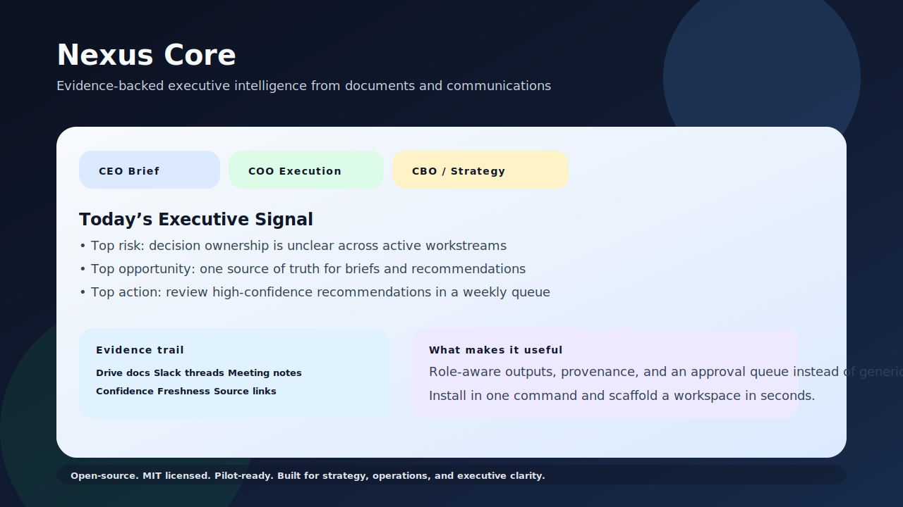

# Nexus Core

[](LICENSE)
[](https://github.com/asjanjua/nexus-core)
[](https://github.com/asjanjua/nexus-core/issues)

Nexus Core is a source-available executive intelligence command layer that turns documents and communications into evidence-backed specialist-agent briefs, decisions, and recommendations.

If you want a faster way to understand what matters across your company, Nexus gives you a team of evidence-backed AI analysts, each focused on a business function, with human approval built in.



## Try It Fast
- Install in one command.
- Scaffold a workspace with `nexus init`.
- Check health with `nexus doctor`.
- Generate role-aware executive outputs from your own sources.
- See a sample output in [demo/README.md](demo/README.md).
- See a sample install and output in [demo/sample-install-and-output.md](demo/sample-install-and-output.md).
- See the launch kit in [launch/README.md](launch/README.md).

Quick install:
```bash
curl -fsSL https://raw.githubusercontent.com/asjanjua/nexus-core/main/scripts/install.sh | bash
```

Then:
```bash
export PATH="$HOME/.nexus/bin:$PATH"
nexus init
nexus doctor
```

## What Nexus Does
- Ingests enterprise content from document and comms sources.
- Extracts structured signals (risks, opportunities, tasks, decisions, KPIs).
- Maps findings to a lightweight enterprise ontology.
- Produces specialist-agent briefs across strategy, risk, execution, growth, technology, data, security, and AI governance.
- Preserves provenance so each insight links back to source evidence.

## V1 Product Scope
Nexus Core V1 is designed for paid enterprise pilots (6-8 weeks), not broad self-serve production rollout.

Included in V1:
- Mission control data contracts and templates
- Evidence-backed recommendation pipeline
- Role-oriented brief and dashboard generation
- Human approval gates for consequential outputs

Not included in V1:
- Autonomous writeback to critical source systems
- Full ERP/HRIS/CRM replacement claims
- Multi-tenant SaaS control plane

## System Shape
NexusAI Mission Control is a standalone intelligence layer. It sits on top of
existing SaaS, ERP, and communications systems without replacing them.

Core components:
- Evidence ingestion and confidence routing
- Specialist agent briefs by role and room
- Human review queue with audit trail
- Agent Control Profiles (governance passports)
- Connector layer for documents, comms, and operational data

## Repository Layout
- `apps/mission-control/` Next.js Mission Control app (dashboard-first UI + API routes)
- `docs/` product architecture, scope, decisions, rollout
- `contracts/` schemas and interface contracts
- `templates/` pilot outputs and operating artifacts
- `scripts/` utility scripts for pilot generation and checks

Mission Control quick start:
```bash
cp .env.example .env.local
cd apps/mission-control
npm install
npm run db:migrate
npm run db:seed
npm run dev
```

Then open `http://localhost:3000/login` and sign in with your configured `MISSION_CONTROL_DEFAULT_USER` and `MISSION_CONTROL_PASSWORD`.
In DB mode, login is validated against the `users` + `roles` tables (workspace-scoped), with hashed passwords.

Database mode:
- `NEXUS_DB_REQUIRED=false` (default for local dev): app can fall back to in-memory store if DB is unavailable.
- `NEXUS_DB_REQUIRED=true` (recommended for staging/prod): startup fails fast unless `DATABASE_URL` is valid and reachable.

DB utility commands:
```bash
npm run db:check
npm run db:migrate
npm run db:seed
```

Pilot operations docs:
- [docs/PILOT_ONBOARDING_CHECKLIST.md](docs/PILOT_ONBOARDING_CHECKLIST.md)
- [docs/SECURITY_DATA_HANDLING.md](docs/SECURITY_DATA_HANDLING.md)
- [docs/PILOT_SUCCESS_SCORECARD.md](docs/PILOT_SUCCESS_SCORECARD.md)
- [docs/EXECUTIVE_PACK_TEMPLATE.md](docs/EXECUTIVE_PACK_TEMPLATE.md)

## Install
Nexus can bootstrap OpenClaw automatically if it is not already installed.

Quick install:
```bash
curl -fsSL https://raw.githubusercontent.com/asjanjua/nexus-core/main/scripts/install.sh | bash
```

Repo-local install:
```bash
bash scripts/nexus-bootstrap.sh
```

Then verify:

```bash
$HOME/.nexus/scripts/nexus-doctor.sh
```

Or, after adding `~/.nexus/bin` to your `PATH`:

```bash
nexus doctor
nexus doctor --json
nexus init
nexus init /path/to/workspace
nexus status
nexus setup
nexus help
```

Full guide: [docs/INSTALL.md](docs/INSTALL.md)
Infrastructure decision memo: [docs/INFRA_DECISION_MEMO.md](docs/INFRA_DECISION_MEMO.md)
Model routing policy: [docs/MODEL_ROUTING.md](docs/MODEL_ROUTING.md)
AI operating model: [docs/AI_OPERATING_MODEL.md](docs/AI_OPERATING_MODEL.md)
Agent rooms: [docs/AGENT_ROOMS.md](docs/AGENT_ROOMS.md)

Release notes: [CHANGELOG.md](CHANGELOG.md)

## Production Readiness
Current status: **Pilot-ready, not production-ready at scale**.

See [docs/PRODUCTION_READINESS.md](docs/PRODUCTION_READINESS.md) for:
- what is ready
- what is missing
- hardening priorities before production

## Ideal Pilot Buyer
- CEO / COO / Chief Strategy Officer / Managing Director
- Transformation office sponsors who need faster, trusted situational awareness

## Why People Star This Repo
- It is practical, not hype-driven.
- It is open-source and free to use.
- It focuses on evidence and provenance instead of generic AI output.
- It gives a clean path from docs and comms to executive decision support.

## Call To Action
If Nexus looks useful:
- star the repo
- open an issue with your use case
- share it with one person who manages decisions, operations, or strategy
- try the install and tell us what would make it more useful for your workflow

## Contribute
Want to help improve Nexus?
- start with [CONTRIBUTING.md](CONTRIBUTING.md)
- file a small issue instead of a vague one
- include a sample source or expected output when possible
- prefer focused pull requests over large rewrites

## License
This project is source-available under the `PolyForm Noncommercial License 1.0.0`.

Noncommercial use is permitted under [LICENSE](LICENSE). Commercial use, hosted deployments, managed services, paid pilots, and enterprise use require a separate commercial license. See [LICENSE.md](LICENSE.md) for the short licensing notice.
