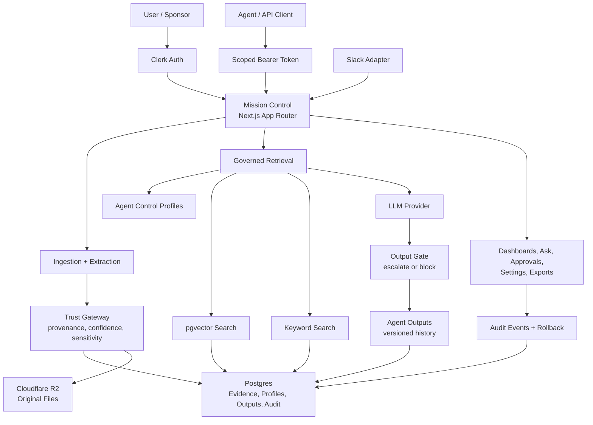
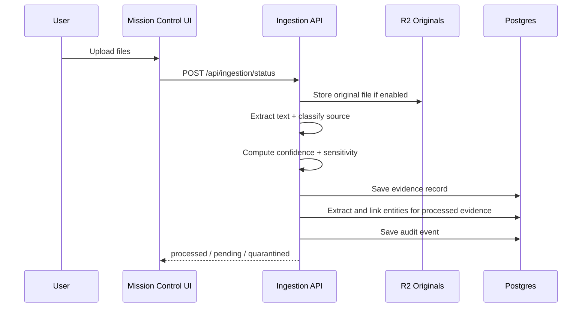
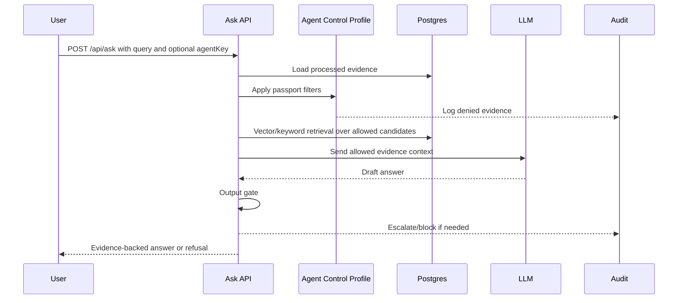
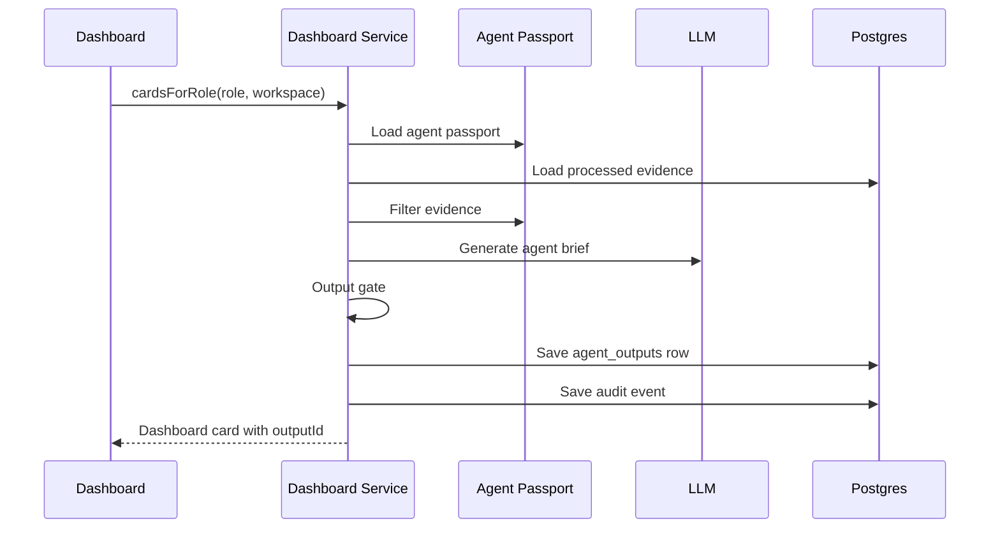
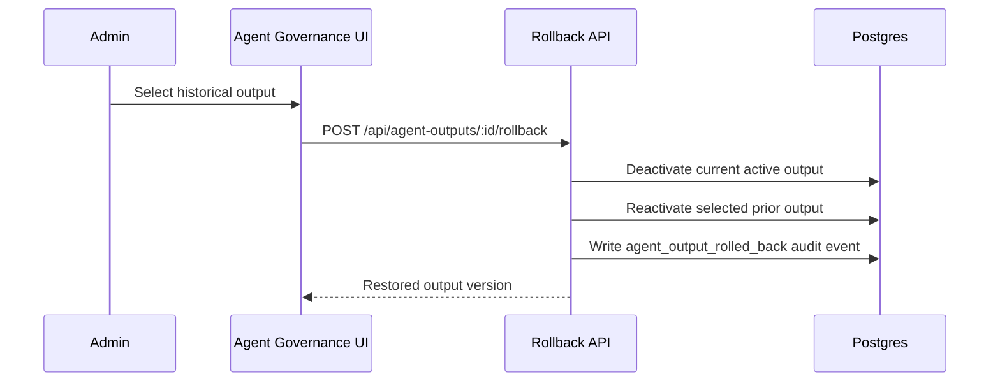

# NexusAI Mission Control Architecture

Updated: 2026-06-10
Current product state: v0.17.0 (verified). Covers U2 Agent Control Profiles, U3 output history/rollback, U4 learning signals, Phase 8A Decision & Action Twin, AI decision proposals, persistent Ask memory, entity extraction, and P2 AI trust controls.

## 1. Purpose

NexusAI Mission Control is a governed intelligence operating layer for high-stakes professional workflows.

It ingests company evidence, structures it with provenance and sensitivity metadata, retrieves only policy-allowed evidence, and produces role-aware agent briefs, recommendations, decisions, and reviewable outputs.

The product is not designed to replace ERP, CRM, HRIS, core banking, BI, legal review, or source systems in V1. It sits above those systems as a decision-support and governance layer.

## 2. Architecture Principles

- Evidence first: every useful output should connect back to source material.
- Governance outside the prompt: permissions are enforced in server-side code, not by prompt instructions alone.
- Human approval: no autonomous sending, filing, payment, HR action, legal commitment, financial commitment, external posting, or source-system writeback in V1.
- Least privilege by agent: each agent has an Agent Control Profile defining what it can see, do, and escalate.
- Rollback-ready history: generated agent outputs are versioned, searchable, and restorable without deleting prior history.
- Additive integration: NexusAI reads from source systems but does not become the system of record for upstream operations.

## 3. Current Infrastructure

| Layer | Current choice | Notes |
|---|---|---|
| Web app | Next.js App Router in `apps/mission-control` | Mission Control UI and API routes |
| Hosting | Render Web Service | Primary pilot deployment path, configured by `render.yaml` |
| Auth | Clerk | Browser sessions and organization-scoped tenancy |
| Agent/API auth | Scoped Bearer tokens | Used for non-browser/agent callers |
| Database | Postgres via Drizzle ORM | Primary system of record |
| Vector retrieval | `pgvector` | Optional semantic retrieval path, filtered before ranking |
| Object storage | Cloudflare R2 | Original-file retention path when enabled |
| LLM providers | DeepSeek/OpenAI/Anthropic-style routing | Centralized LLM service with route policy |
| Edge/security | Cloudflare selective services | DNS/CDN/WAF/AI Gateway/R2; no full Workers migration in V1 |

## 4. System Diagram

## 5. Core Product Layers

### 5.1 Source Ingestion Layer

Inputs include uploaded documents and selected communication sources.

Current primary paths:
- PDF, DOCX, PPTX, XLSX, TXT, Markdown uploads
- Slack adapter/events
- Google Drive / SharePoint / Teams remain connector roadmap surfaces

Every evidence record carries:
- `workspaceId`
- `sourceType`
- `sourcePath`
- `sourceUri`
- `sourceTimestamp`
- `ingestedAt`
- `hash`
- `sensitivity`
- `extractionConfidence`
- `freshnessHours`
- `ingestionStatus`

Original files can be retained in R2 when `NEXUS_R2_ORIGINALS=enabled`.

### 5.2 Trust Gateway

The ingestion layer classifies evidence into:
- `processed`: high enough confidence to enter dashboards and Ask
- `pending_approval`: requires human review before synthesis
- `quarantined`: excluded from executive outputs
- `failed`: extraction or processing failed

Low-confidence, missing-provenance, restricted, or policy-denied evidence does not enter executive outputs.

### 5.3 Evidence and Retrieval Layer

Postgres is the system of record. `pgvector` is used for semantic search when enabled, with keyword search as fallback.

Retrieval rules:
- workspace scope is always applied
- processed status is required
- restricted evidence is excluded from general retrieval
- Agent Control Profile filtering runs before vector ranking and before keyword ranking
- denied evidence is audited
- forbidden evidence must not enter model prompt context

### 5.4 Agent Governance Layer

U2 introduced Agent Control Profiles, also called passports.

Each profile defines:
- identity: `agentKey`, name, purpose, version, status
- data controls: allowed scopes, forbidden scopes, max sensitivity
- tool controls: allowed tools, forbidden tools, policy-controlled APIs
- action rights: retrieve, summarize, draft, recommend, prepare for approval
- hard stops: email sending, filings, payments, contract modification, regulator contact, external posting, source-system writeback, HR action, legal/financial commitment
- escalation triggers: legal, regulatory, pricing, data residency, data protection, cross-entity access, external communication, financial thresholds
- approval level, risk rating, review cadence, watcher agents, log level

Profiles are versioned. Editing creates a new profile row. Suspended agents cannot retrieve evidence or generate outputs.

### 5.5 Agent Output Layer

U3 introduced rollback-ready agent output history through `agent_outputs`.

Every dashboard agent brief writes:
- output id
- workspace id
- agent id
- agent profile version
- role key
- full content
- input summary
- evidence refs
- confidence
- output version
- active flag
- replaced-by linkage
- created timestamp

Rollback restores a prior output version, deactivates the current active version, preserves all historical rows, and writes an audit event.

### 5.6 Delivery Layer

Primary surfaces:
- Mission Control dashboards / Agent Rooms
- Ask panel
- Settings / Agent Governance
- Approvals and review queues
- Evidence drill-down
- Export pages and pilot kit
- Slack as a governed secondary surface

### 5.7 Learning Signal Layer

U4 introduced per-output learning signal capture through `learning_signals`.

Signal types: approve, edit, reject, thumbs_up, thumbs_down. Each signal records the output ID, workspace, signal type, optional comment, and actor. Every signal write fires an `agent_learning_signal` audit event.

The Agent Output Log UI shows signal buttons on every output card. Summary endpoint aggregates signal counts and quality metrics per agent.

This is the foundation for future learning loops (U9).

### 5.8 AI Trust Layer

P2 introduced an explicit trust layer for regulated-buyer confidence.

It includes:
- 30-case eval harness across risk, decisions, recommendations, classification, grounding, and refusal.
- Prompt registry with versioned prompt metadata and read-only admin manifest.
- Red-team output checks for PII, overconfidence, unsafe actions, sensitivity ceiling breaches, and hard-stop leakage.
- Workspace AI policy controls for allowed providers, local-only mode, sensitivity ceiling, and approval threshold.
- Audit events for prompt renders, red-team violations, and eval completion.

### 5.9 Decision & Action Twin Layer

Phase 8A introduced the Decision & Action Twin through extended `decisions` and new `actions` tables.

Decisions carry: title, description, status (open/decided/deferred/cancelled), priority (low/medium/high/critical), deadline, sourceOutputId (FK to agent_outputs for future auto-extraction), and full audit trail.

Actions carry: decisionId (FK cascade), actionText, owner, dueDate, isBlocker flag, status (open/in_progress/done/cancelled), completedAt. Blocker-first sort ensures critical blockers surface first.

Current state: full CRUD via API and interactive `/decisions` page. AI proposal extraction from recent `agent_outputs` is built through `/api/decisions/extract`; proposed decisions/actions remain drafts until a user explicitly creates them.

## 6. Key Data Stores

| Table | Purpose |
|---|---|
| `workspaces` | tenant/workspace status and billing state |
| `workspace_settings` | runtime settings, LLM model, demo mode |
| `workspace_profiles` | company profile and context |
| `evidence_records` | extracted evidence, provenance, confidence, sensitivity, embeddings |
| `recommendations` | AI-generated or reviewed recommendations |
| `decisions` | decision records with priority, deadline, sourceOutputId, rationale |
| `actions` | action items linked to decisions with blocker flags and status |
| `approvals` | human approval records |
| `audit_events` | append-style event log |
| `agent_control_profiles` | U2 agent passports and versions |
| `agent_outputs` | U3 rollback-ready generated output history |
| `learning_signals` | U4 per-output quality signals (approve/edit/reject/thumbs) |
| `entities` | extracted people, organizations, risks, KPIs, amounts, dates, systems, processes |
| `evidence_entity_links` | evidence-to-entity backlinks with confidence |
| `prompt_registry` | versioned prompt manifest entries |
| `eval_runs` | persisted eval summaries and per-case results |
| `agent_keys` | scoped API key access |
| `connectors` | installed connector metadata and encrypted credentials |
| `llm_usage` | cost and usage tracking |

## 7. Main Runtime Flows

### 7.1 Ingestion Flow

### 7.2 Ask Flow

### 7.3 Dashboard Agent Brief Flow

### 7.4 Rollback Flow

## 8. Public and Internal Interfaces

### Core User Routes

- `/dashboard/[role]`
- `/ask`
- `/ingestion`
- `/approvals`
- `/recommendations`
- `/decisions`
- `/evidence/[id]`
- `/settings`
- `/settings/connectors`
- `/export`
- `/pilot-kit`
- `/readiness`

### Key API Routes

- `POST /api/ingestion/status`
- `POST /api/ask`
- `GET /api/dashboard/[role]`
- `GET /api/evidence`
- `GET /api/evidence/[id]`
- `POST /api/evidence/[id]/review`
- `GET /api/agent-control-profiles`
- `POST /api/agent-control-profiles`
- `POST /api/agent-control-profiles/[agentKey]/suspend`
- `GET /api/agent-outputs`
- `POST /api/agent-outputs/[id]/rollback`
- `GET/POST /api/decisions`
- `PATCH /api/decisions/[id]`
- `GET/POST /api/actions`
- `PATCH /api/actions/[id]`
- `POST /api/learning-signals`
- `GET /api/learning-signals`
- `GET /api/learning-signals/summary`
- `GET /api/audit/events`

## 9. Security and Governance Boundaries

### Enforced Today

- Clerk browser auth and workspace scoping
- Bearer-token API auth with scopes
- workspace-scoped data access
- evidence confidence and quarantine controls
- sensitivity labels
- Agent Control Profile filtering before retrieval
- restricted-data blocking from general outputs
- deterministic output gates
- hard-stop action blocking
- audit events for denied evidence, blocked outputs, tool denial, profile changes, output creation, and rollback
- versioned agent outputs

### Deliberately Not Enabled in V1

- autonomous outbound emails
- autonomous legal or financial commitments
- source-system writeback
- autonomous HR actions
- autonomous filings or regulator contact
- unrestricted Slack/Teams summaries
- full ERP/CRM/HRIS replacement

## 10. Current Completion State (verified 2026-06-10)

| Area | Status |
|---|---|
| Core Mission Control app | Complete for pilot |
| Ingestion and provenance | Complete for pilot |
| Workspace/company profile onboarding | Complete for pilot |
| Role and Agent Room model (20 roles, 5 archetypes) | Complete |
| Agent Rooms (7 rooms, named specialists) | Complete |
| U2 Agent Control Profiles / passports | Complete |
| U3 Output log and rollback | Complete |
| U4 Learning signal capture | Complete (v0.15.0) |
| Phase 8A Decision & Action Twin | Complete (v0.16.0) |
| Phase 8A Decision auto-extraction from agent outputs | Complete (v0.16.1) |
| Ask conversation memory | Complete (v0.16.2) |
| Entity extraction | Complete (v0.16.3) |
| P2 AI trust layer | Complete (v0.17.0) |
| Executive Synthesis Layer | Approved for build -- dispatcher + role-aware synthesis |
| Connectors | Skeleton only (Slack OAuth/events) |
| Workflow Twin Scorer | Planned Phase 8B |
| Ops Review Twin | Planned Phase 8C |
| Local/on-prem edge client | Later enterprise moat |

## 11. Near-Term Architecture Roadmap

### Executive Synthesis Layer (APPROVED FOR BUILD -- next)

A thin dispatcher collects the latest active agent_outputs for a workspace grouped by role/room, then a synthesis service produces one evidence-backed leadership brief per role. The CEO gets a cross-functional synthesis answering 7 questions (what changed, what matters, what needs a decision, what is at risk, where are we blocked, what to do next, what evidence supports this). Every other leadership role gets a role-tuned synthesis with 5 questions. Archetype language (corporate vs sme_physical) carries through to the synthesis. No new tables: synthesis outputs use agent_outputs with outputType "synthesis". Dashboard reframe: synthesis becomes the primary view, specialist agent cards become drill-down. Full spec in docs/EXECUTIVE_SYNTHESIS_SPEC.md.

### Entity Pages and Backlinks (next Company Memory step)

Entity extraction now writes `entities` and `evidence_entity_links` during ingestion for processed evidence. The next architecture step is to add entity pages, timeline views, backlinks from decisions/recommendations/actions, and graph traversal for Company Memory.

### Scheduled Synthesis

Once the synthesis layer exists, a scheduled task can trigger synthesis refresh on a cadence (daily, weekly). The CEO receives a fresh "company picture" every Monday morning without logging in.

### Phase 8B: Workflow Twin Scorer

Score candidate workflows by frequency, pain, data readiness, risk, senior judgment required, reusability, monetization, and speed benefit.

### Phase 8C: Ops Review Twin

Recurring operating review: blockers, KPIs, overdue owners, department status, follow-up actions.

## 12. Architecture Decisions to Preserve

- Keep Postgres plus `pgvector` for V1 evidence and retrieval.
- Keep Clerk for self-serve signup and organization tenancy.
- Keep Cloudflare adoption selective, not a full runtime migration.
- Keep source systems as source systems.
- Keep governance controls server-side.
- Keep human approval as the boundary for consequential actions.
- Keep output history append-style and rollback-ready; never delete prior versions as part of rollback.
