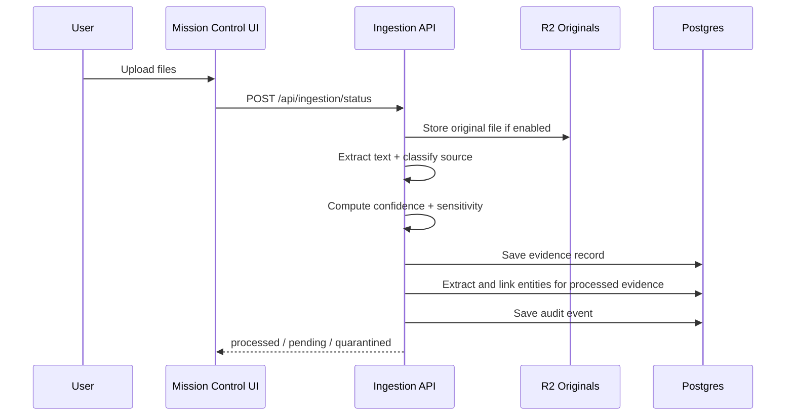
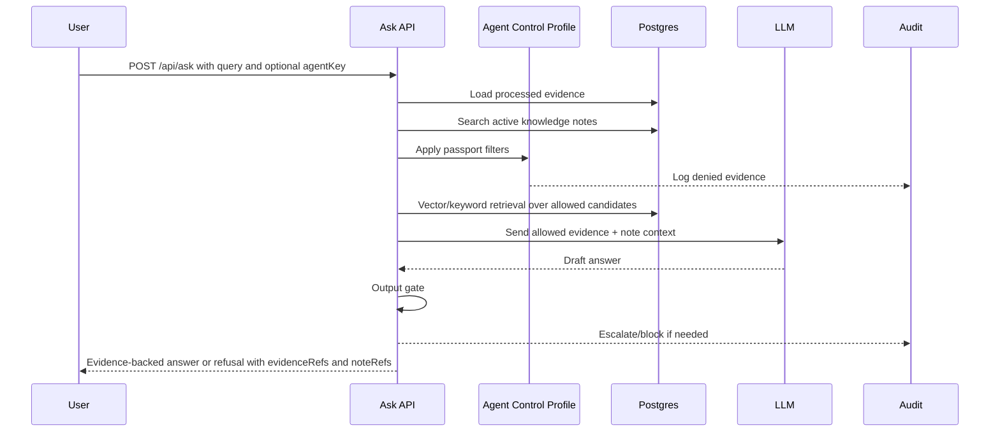
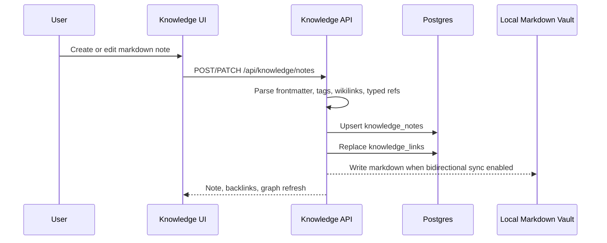
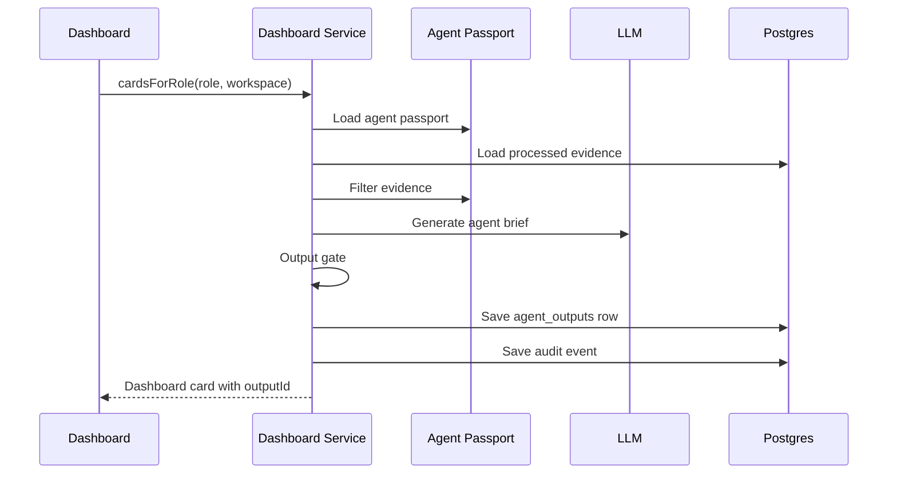
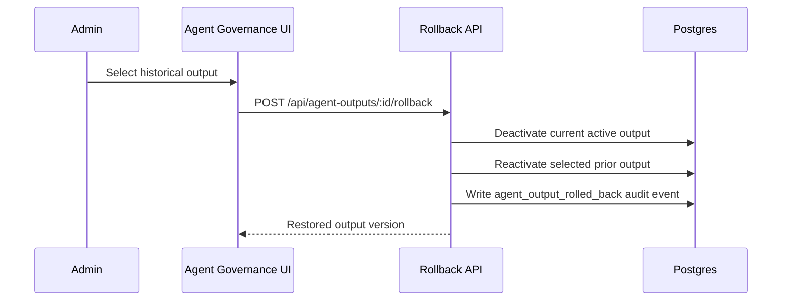

# NexusAI Mission Control Architecture

Updated: 2026-07-10
Current product state: v0.25.0 (verified locally 2026-06-17). Covers U2 Agent Control Profiles, U3 output history/rollback, U4 learning signals, Phase 8A Decision & Action Twin, AI decision proposals, persistent Ask memory, entity extraction and Company Memory pages, P2 AI trust controls, the Executive Synthesis Layer, synthesis source/entity traceability, scheduled synthesis core, workflow twin primitives, billing tiers with Stripe integration, the orchestration dispatcher, the first Slack connector ingestion path, v0.23.1 production hardening/auth-navigation fixes, Connector Settings policy UX, Workflow Twin Scorer, U6 backcasting, U7 shadow ROI instrumentation, and v0.25.0 Knowledge Workspace with Markdown import/export, optional local vault sync, MCP memory tools, and Ask note refs.

## 1. Purpose

NexusAI Mission Control is a governed intelligence operating layer for high-stakes professional workflows.

It ingests company evidence, structures it with provenance and sensitivity metadata, retrieves only policy-allowed evidence, and produces role-aware agent briefs, recommendations, decisions, and reviewable outputs.

The product is not designed to replace ERP, CRM, HRIS, core banking, BI, legal review, or source systems in V1. It sits above those systems as a decision-support and governance layer.

## 2. Architecture Principles

- Evidence first: every useful output should connect back to source material.
- Governance outside the prompt: permissions are enforced in server-side code, not by prompt instructions alone.
- Human approval: no autonomous sending, filing, payment, HR action, legal commitment, financial commitment, external posting, or source-system writeback in V1.
- Least privilege by agent: each agent has an Agent Control Profile defining what it can see, do, and escalate.
- Rollback-ready history: generated agent outputs are versioned, searchable, and restorable without deleting prior history.
- Additive integration: NexusAI reads from source systems but does not become the system of record for upstream operations.
- Typed runtime safety: long-running runners, connector sync jobs, verifier loops, and future local/on-prem auth flows should follow `docs/ENGINEERING_GUARDRAILS.md` so invalid states, hidden async failures, and ambiguous auth modes are rejected by design.

## 3. Current Infrastructure

| Layer | Current choice | Notes |
|---|---|---|
| Web app | Next.js App Router in `apps/mission-control` | Mission Control UI and API routes |
| API boundary | Modular monolith | Thin route handlers; domain logic in services/data/connectors. Separate-service triggers are documented in `docs/API_SERVICE_BOUNDARY_DECISION.md` |
| Hosting | Render Web Service | Primary pilot deployment path, configured by `render.yaml` |
| Auth | Clerk | Browser sessions and organization-scoped tenancy |
| Agent/API auth | Scoped Bearer tokens | Used for non-browser/agent callers |
| Database | Postgres via Drizzle ORM | Primary system of record |
| Vector retrieval | `pgvector` | Optional semantic retrieval path, filtered before ranking |
| Object storage | Cloudflare R2 | Original-file retention path when enabled |
| Knowledge vault | Postgres + Markdown import/export | Postgres is canonical for hosted governance; Markdown is the portability/sync layer |
| Local sync | Optional filesystem watcher | Enabled only with `NEXUS_VAULT_SYNC` and an absolute `NEXUS_LOCAL_VAULT_PATH` |
| LLM providers | DeepSeek/OpenAI/Anthropic-style routing | Centralized LLM service. Route policy declared in `model-routing.ts` (10 surfaces, fallback chains) but NOT yet wired into `llm.ts` execution path. See §12. |
| Edge/security | Cloudflare selective services | DNS/CDN/WAF/AI Gateway/R2; no full Workers migration in V1 |

Mission Control intentionally remains one deployable pilot application. This is not permission to couple UI and server internals: client components call relative `/api/*` routes, route handlers enforce auth/contracts, and domain/provider logic stays outside route files. The first future extraction target is asynchronous ingestion/agent execution, only after measured scale, compliance, or release-cadence triggers are met.

## 4. System Diagram

```mermaid
flowchart TB
  User["User / Sponsor"] --> Clerk["Clerk Auth"]
  Clerk --> MC["Mission Control<br/>Next.js App Router"]

  APIClient["Agent / API Client"] --> Bearer["Scoped Bearer Token"]
  Bearer --> MC

  Slack["Slack Adapter"] --> MC

  MC --> Ingestion["Ingestion + Extraction"]
  Ingestion --> Trust["Trust Gateway<br/>provenance, confidence, sensitivity"]
  Trust --> DB["Postgres<br/>Evidence, Profiles, Outputs, Audit"]
  Trust --> R2["Cloudflare R2<br/>Original Files"]

  MC --> Retrieval["Governed Retrieval"]
  Retrieval --> ACP["Agent Control Profiles"]
  Retrieval --> Vector["pgvector Search"]
  Retrieval --> Keyword["Keyword Search"]
  Vector --> DB
  Keyword --> DB

  Retrieval --> LLM["LLM Provider"]
  LLM --> Gate["Output Gate<br/>escalate or block"]
  Gate --> Outputs["Agent Outputs<br/>versioned history"]
  Outputs --> DB
  Outputs --> Synthesis["Executive Synthesis<br/>on-demand leadership brief"]
  Synthesis --> UI

  MC --> Knowledge["Knowledge Workspace<br/>notes, backlinks, graph, sync"]
  Knowledge --> DB
  Knowledge --> Vault["Local Markdown Vault<br/>optional"]

  MC --> UI["Dashboards, Ask, Approvals,<br/>Knowledge, Settings, Exports"]
  UI --> Audit["Audit Events + Rollback"]
  Audit --> DB
```

## 5. Core Product Layers

### 5.1 Source Ingestion Layer

Inputs include uploaded documents and selected communication sources.

Current primary paths:
- PDF, DOCX, PPTX, XLSX, TXT, Markdown uploads
- Slack adapter/events
- Google Drive / SharePoint / Teams remain connector roadmap surfaces

Every evidence record carries:
- `workspaceId`
- `sourceType`
- `sourcePath`
- `sourceUri`
- `sourceTimestamp`
- `ingestedAt`
- `hash`
- `sensitivity`
- `extractionConfidence`
- `freshnessHours`
- `ingestionStatus`

Original files can be retained in R2 when `NEXUS_R2_ORIGINALS=enabled`.

### 5.2 Trust Gateway

The ingestion layer classifies evidence into:
- `processed`: high enough confidence to enter dashboards and Ask
- `pending_approval`: requires human review before synthesis
- `quarantined`: excluded from executive outputs
- `failed`: extraction or processing failed

Low-confidence, missing-provenance, restricted, or policy-denied evidence does not enter executive outputs.

### 5.3 Evidence and Retrieval Layer

Postgres is the system of record. `pgvector` is used for semantic search when enabled, with keyword search as fallback.

Retrieval rules:
- workspace scope is always applied
- processed status is required
- restricted evidence is excluded from general retrieval
- Agent Control Profile filtering runs before vector ranking and before keyword ranking
- denied evidence is audited
- forbidden evidence must not enter model prompt context

### 5.4 Agent Governance Layer

U2 introduced Agent Control Profiles, also called passports.

Each profile defines:
- identity: `agentKey`, name, purpose, version, status
- data controls: allowed scopes, forbidden scopes, max sensitivity
- tool controls: allowed tools, forbidden tools, policy-controlled APIs
- action rights: retrieve, summarize, draft, recommend, prepare for approval
- hard stops: email sending, filings, payments, contract modification, regulator contact, external posting, source-system writeback, HR action, legal/financial commitment
- escalation triggers: legal, regulatory, pricing, data residency, data protection, cross-entity access, external communication, financial thresholds
- approval level, risk rating, review cadence, watcher agents, log level

Profiles are versioned. Editing creates a new profile row. Suspended agents cannot retrieve evidence or generate outputs.

### 5.5 Agent Output Layer

U3 introduced rollback-ready agent output history through `agent_outputs`.

Every dashboard agent brief writes:
- output id
- workspace id
- agent id
- agent profile version
- role key
- full content
- input summary
- evidence refs
- confidence
- output version
- active flag
- replaced-by linkage
- created timestamp

Rollback restores a prior output version, deactivates the current active version, preserves all historical rows, and writes an audit event.

### 5.6 Delivery Layer

Primary surfaces:
- Mission Control dashboards / Agent Rooms
- Ask panel
- Settings / Agent Governance
- Approvals and review queues
- Evidence drill-down
- Export pages and pilot kit
- Slack as a governed secondary surface

### 5.7 Learning Signal Layer

U4 introduced per-output learning signal capture through `learning_signals`.

Signal types: approve, edit, reject, thumbs_up, thumbs_down. Each signal records the output ID, workspace, signal type, optional comment, and actor. Every signal write fires an `agent_learning_signal` audit event.

The Agent Output Log UI shows signal buttons on every output card. Summary endpoint aggregates signal counts and quality metrics per agent.

This is the foundation for future learning loops (U9).

### 5.8 AI Trust Layer

P2 introduced an explicit trust layer for regulated-buyer confidence.

It includes:
- 30-case eval harness across risk, decisions, recommendations, classification, grounding, and refusal.
- Prompt registry with versioned prompt metadata and read-only admin manifest.
- Red-team output checks for PII, overconfidence, unsafe actions, sensitivity ceiling breaches, and hard-stop leakage.
- Workspace AI policy controls for allowed providers, local-only mode, sensitivity ceiling, and approval threshold.
- Audit events for prompt renders, red-team violations, and eval completion.

### 5.9 Decision & Action Twin Layer

Phase 8A introduced the Decision & Action Twin through extended `decisions` and new `actions` tables.

Decisions carry: title, description, status (open/decided/deferred/cancelled), priority (low/medium/high/critical), deadline, sourceOutputId (FK to agent_outputs for future auto-extraction), and full audit trail.

Actions carry: decisionId (FK cascade), actionText, owner, dueDate, isBlocker flag, status (open/in_progress/done/cancelled), completedAt. Blocker-first sort ensures critical blockers surface first.

Current state: full CRUD via API and interactive `/decisions` page. AI proposal extraction from recent `agent_outputs` is built through `/api/decisions/extract`; proposed decisions/actions remain drafts until a user explicitly creates them.

### 5.9a Knowledge Workspace Layer

v0.25.0 introduced the Nexus Knowledge Workspace at `/knowledge`.

The layer adds:
- markdown notes with title, path, body, tags, sensitivity, status, source kind, and frontmatter
- parsed `[[wikilinks]]`, `#tags`, headings, and typed Nexus refs
- graph projection across notes, evidence, entities, workflow twins, decisions, and recommendations
- Obsidian-compatible ZIP import/export
- optional local filesystem sync for local/dev/desktop/self-hosted environments
- MCP-compatible memory tools through `scripts/knowledge-mcp.mjs`

Postgres remains canonical for hosted governance. Markdown is the portability and optional sync representation. Hosted deployments should leave live sync disabled.

Live sync controls:
- `NEXUS_VAULT_SYNC=disabled|readonly|bidirectional`
- `NEXUS_LOCAL_VAULT_PATH=/absolute/path/to/vault`

Safety boundaries:
- only `.md` files are processed
- traversal and unsupported extensions are rejected
- hidden system files are rejected except `.nexus` and `.conflicts`
- symlinks outside the vault are rejected
- oversized files are rejected
- conflicts are preserved under `.conflicts/`

### 5.10 Executive Synthesis Layer

v0.18.0 introduced an on-demand synthesis layer that reframes leadership dashboards from "several agent cards" into one role-aware brief first, with specialist agent detail underneath.

Current behavior:
- `lib/services/synthesis.ts` dispatches to `cardsForRole()` to collect the same governed specialist cards a role already sees.
- The service builds a single specialist-brief context block, applies workspace company context and archetype language, then answers role-specific leadership questions.
- CEO gets seven cross-functional questions. COO, CFO, CTO/CDO, CBO/CMO, and CHRO get five role-tuned questions. Other roles use a generic leadership set.
- Each synthesis answer runs through red-team checks before display.
- Each synthesis answer includes readable source pills and extracted entity chips when evidence links are available.
- `GET /api/synthesis/[role]` exposes the synthesis with `read:dashboard` scope.
- `POST /api/synthesis/[role]` regenerates and persists a refreshed synthesis into `agent_outputs`.
- The dashboard renders the synthesis as the primary panel and puts specialist cards in a collapsible drill-down section.

No v0.18.0-v0.18.2 migration was added. Normal dashboard synthesis is computed on demand. Manual refresh persists a versioned synthesis snapshot to `agent_outputs` using `agent_id = synthesis_<role>`, so U3 history/rollback/audit infrastructure remains the history layer. Scheduled refresh and synthesis-level learning signals remain follow-on polish items.

## 6. Key Data Stores

| Table | Purpose |
|---|---|
| `workspaces` | tenant/workspace status and billing state |
| `workspace_settings` | runtime settings, LLM model, demo mode |
| `workspace_profiles` | company profile and context |
| `evidence_records` | extracted evidence, provenance, confidence, sensitivity, embeddings |
| `recommendations` | AI-generated or reviewed recommendations |
| `decisions` | decision records with priority, deadline, sourceOutputId, rationale |
| `actions` | action items linked to decisions with blocker flags and status |
| `approvals` | human approval records |
| `audit_events` | append-style event log |
| `agent_control_profiles` | U2 agent passports and versions |
| `agent_outputs` | U3 rollback-ready generated output history |
| `learning_signals` | U4 per-output quality signals (approve/edit/reject/thumbs) |
| `synthesis_schedules` | workspace cadence for scheduled synthesis refresh |
| `workflow_twins` | configured workflow twins for Decision & Action, Workflow Scorer, and Ops Review |
| `workflow_twin_runs` | run history with evidence refs, output refs, confidence, and review status |
| `entities` | extracted people, organizations, risks, KPIs, amounts, dates, systems, processes |
| `evidence_entity_links` | evidence-to-entity backlinks with confidence |
| `knowledge_notes` | workspace markdown notes with frontmatter, tags, sensitivity, typed refs, and optional embeddings |
| `knowledge_links` | parsed note backlinks and typed links to notes/evidence/entities/workflows/decisions/recommendations |
| `knowledge_sync_events` | import/export/local sync/watch event history |
| `prompt_registry` | versioned prompt manifest entries |
| `eval_runs` | persisted eval summaries and per-case results |
| `agent_keys` | scoped API key access |
| `connectors` | installed connector metadata and encrypted credentials |
| `llm_usage` | cost and usage tracking |

## 7. Main Runtime Flows

### 7.1 Ingestion Flow

### 7.2 Ask Flow

### 7.2a Knowledge Workspace Flow

### 7.3 Dashboard Agent Brief Flow

### 7.4 Rollback Flow

## 8. Public and Internal Interfaces

### Core User Routes

- `/dashboard/[role]`
- `/ask`
- `/ingestion`
- `/approvals`
- `/recommendations`
- `/decisions`
- `/knowledge`
- `/evidence/[id]`
- `/settings`
- `/settings/connectors`
- `/export`
- `/pilot-kit`
- `/readiness`

### Key API Routes

- `POST /api/ingestion/status`
- `POST /api/ask`
- `GET /api/dashboard/[role]`
- `GET /api/evidence`
- `GET /api/evidence/[id]`
- `POST /api/evidence/[id]/review`
- `GET/POST /api/knowledge/notes`
- `GET/PATCH/DELETE /api/knowledge/notes/[id]`
- `GET /api/knowledge/search`
- `GET /api/knowledge/graph`
- `POST /api/knowledge/import`
- `POST /api/knowledge/export`
- `POST /api/knowledge/triage`
- `GET/POST /api/knowledge/sync`
- `GET /api/agent-control-profiles`
- `POST /api/agent-control-profiles`
- `POST /api/agent-control-profiles/[agentKey]/suspend`
- `GET /api/agent-outputs`
- `POST /api/agent-outputs/[id]/rollback`
- `GET/POST /api/decisions`
- `PATCH /api/decisions/[id]`
- `GET/POST /api/actions`
- `PATCH /api/actions/[id]`
- `POST /api/learning-signals`
- `GET /api/learning-signals`
- `GET /api/learning-signals/summary`
- `GET /api/audit/events`

## 9. Security and Governance Boundaries

### Enforced Today

- Clerk browser auth and workspace scoping
- Bearer-token API auth with scopes
- workspace-scoped data access
- evidence confidence and quarantine controls
- sensitivity labels
- Agent Control Profile filtering before retrieval
- restricted-data blocking from general outputs
- deterministic output gates
- hard-stop action blocking
- audit events for denied evidence, blocked outputs, tool denial, profile changes, output creation, and rollback
- versioned agent outputs
- workspace-scoped knowledge notes and links
- local vault sync disabled by default on hosted deployments
- vault sync path validation, extension checks, hidden-file checks, symlink checks, size checks, and conflict preservation

### Deliberately Not Enabled in V1

- autonomous outbound emails
- autonomous legal or financial commitments
- source-system writeback
- autonomous HR actions
- autonomous filings or regulator contact
- unrestricted Slack/Teams summaries
- full ERP/CRM/HRIS replacement

## 10. Current Completion State (updated 2026-06-17)

| Area | Status |
|---|---|
| Core Mission Control app | Complete for pilot |
| Ingestion and provenance | Complete for pilot |
| Workspace/company profile onboarding | Complete for pilot |
| Role and Agent Room model (20 roles, 5 archetypes) | Complete |
| Agent Rooms (7 rooms, named specialists) | Complete |
| U2 Agent Control Profiles / passports | Complete |
| U3 Output log and rollback | Complete |
| U4 Learning signal capture | Complete (v0.15.0) |
| Phase 8A Decision & Action Twin | Complete (v0.16.0) |
| Phase 8A Decision auto-extraction from agent outputs | Complete (v0.16.1) |
| Ask conversation memory | Complete (v0.16.2) |
| Entity extraction | Complete (v0.16.3) |
| P2 AI trust layer | Complete (v0.17.0) |
| Executive Synthesis Layer | Complete (v0.18.0) -- on-demand role-aware synthesis |
| Executive Synthesis Traceability | Complete (v0.18.1) -- source pills and entity chips |
| Executive Synthesis Refresh/History | Complete (v0.18.2) -- manual refresh saved to output history |
| Scheduled Synthesis Refresh Core | Complete (v0.19.0) -- schedule config, cron endpoint, in-app history |
| Workflow Twin Primitives | Complete (v0.19.1) -- workflow twin and run storage/APIs |
| Connector Settings Policy UX | Complete locally (v0.24.0) -- Slack allowlist, source policy, sensitivity controls, status metadata |
| Workflow Twin Scorer Product Path | Complete locally (v0.24.0) -- `/workflows` page, scoring run, recommended first pilot |
| U6 Backcasting Scope Capture | Complete locally (v0.24.0) -- backcast API/UI stores target state, milestones, evidence, approval boundaries |
| U7 Shadow ROI Instrumentation | Complete locally (v0.24.0) -- manual-vs-Nexus measurement stored on workflow twin config |
| Knowledge Workspace | Complete locally (v0.25.0) -- markdown notes, wikilinks, graph, import/export, optional live local vault sync, MCP wrapper, Ask note refs |
| Billing Tiers Session 1 | Complete (v0.20.0) -- plan-gated token budgets, feature flags (8), cron reset, settings tab |
| Billing Tiers Session 2 | Complete (v0.21.0) -- Stripe Checkout, webhook lifecycle (5 events), Billing Portal, trial-to-free |
| Orchestration Dispatcher | Complete (v0.22.0) -- dispatch_jobs queue, atomic claim, priority/retry/fan-out, 4 handlers, cron runner |
| Company Memory UI | Complete (v0.23.0) -- entity index/detail pages, timelines, backlinks to evidence, decisions, recommendations, and actions |
| Slack Connector Ingestion | First inbound path complete (v0.23.0) -- allowlisted channel messages become governed evidence; DMs and non-allowlisted channels are skipped/audited |
| Production Hardening | Complete (v0.23.1) -- Stripe idempotency, cron/webhook rate limits, Clerk CSP domain, dispatch typing, public/auth shell fixes |
| Connectors | First Slack ingestion path and policy UX shipped; additional connectors and scheduled sync remain open |
| Entity Pages and Backlinks | Complete (v0.23.0) |
| Workflow Twin Scorer | Complete locally (v0.24.0) -- ranked candidates, recommendation, scoring weights, UI path |
| Ops Review Twin | Primitive run payload shipped; product UI/AI review planned Phase 8C |
| Local/on-prem edge client | Later enterprise moat |

## 11. Near-Term Architecture Roadmap

### Billing Tiers (shipped v0.20.0–v0.21.0)

Four-tier billing (Free/Pro/Business/Enterprise). `plan_definitions` table defines token limits and feature flags per plan. Per-workspace token budget enforced with a 5-minute in-process cache before every LLM call. Stripe pure-fetch client (no SDK) handles Checkout Sessions, Billing Portal, and webhook lifecycle (5 event types). Trial converts to Free at day 14. Full spec: `docs/BILLING_TIERS_SPEC.md`.

### Orchestration Dispatcher (shipped v0.22.0)

`dispatch_jobs` table is a durable DB queue. `enqueueJob()` inserts a pending row. `claimPendingJob()` atomically claims with `UPDATE...WHERE id=(SELECT...FOR UPDATE SKIP LOCKED)` — prevents double-execution in concurrent cron ticks. `runDispatchCycle()` processes up to `NEXUS_DISPATCH_BATCH_SIZE` jobs sequentially to avoid token burst. Four handlers: `agent_brief` → `cardsForRole()`, `synthesis` → `synthesiseForRole()`, `workflow_run` → `buildWorkflowTwinRunInput()`, `decision_extract` → `proposeDecisionsFromAgentOutputs()`. Fan-out enqueue enables one-call synthesis across all active roles. Retry with exponential backoff (30s / 5m / 30m). Full spec: `docs/DISPATCHER_SPEC.md`.

### Entity Pages and Backlinks (shipped v0.23.0)

Entity extraction writes `entities` and `evidence_entity_links` during ingestion for processed evidence. `/entities` provides the Company Memory index with type/search filters. `/entities/[id]` provides the detail view: linked evidence, decisions, recommendations, actions, and a timestamped activity timeline. This is the first visible layer of Company Memory; deeper graph traversal and diff views remain future Phase 12 work.

### Slack Connector Ingestion (first path shipped v0.23.0)

Slack events now split into two governed paths. `app_mention` events remain Ask interactions. Normal channel messages can ingest as evidence only when the channel is explicitly allowlisted through `SLACK_INGEST_CHANNELS` or the development override `NEXUS_SLACK_INGEST_ALL=enabled`. Direct messages, bot/system messages, unsupported event types, and non-allowlisted channels are skipped and audited. Accepted messages flow through `ingestEvidence()` so provenance, sensitivity, confidence, embeddings, entity extraction, and audit behavior stay consistent with uploaded documents.

### Phase 8B: Workflow Twin Scorer (complete locally v0.24.0)

Score candidate workflows by frequency, pain, data readiness, risk, senior judgment required, reusability, monetization, and speed benefit.

Implemented as the `/workflows` product surface plus `workflow_scorer` run payload. It ranks Decision & Action, Ops Review, Proposal/SOW, Regulatory Response, Agreement Review, and Risk Review candidates and marks the recommended first Parallel Workflow Pilot.

### U6/U7: Backcasting and Shadow ROI (complete locally v0.24.0)

Backcasting and ROI are stored in `workflow_twins.config` for V1 speed, with audit events through the repository update path. This is intentionally not a new reporting table yet. Promote to first-class tables only after pilots create enough measurements to need analytics across accounts.

### Phase 8C: Ops Review Twin

Recurring operating review: blockers, KPIs, overdue owners, department status, follow-up actions.

## 12. Architecture Review Findings (2026-06-25)

### LLM Routing: Policy vs Execution Gap

`lib/config/model-routing.ts` declares a 10-surface routing policy with 5 provider profiles, per-surface fallback chains, data class restrictions, confidence floors, draft-then-refine flow markers, and `requiresApprovalBeforeUse` gates. It exports `routePolicyFor(surfaceId)` and `providerProfileFor(provider)`.

`lib/services/llm.ts` does not import or use any of this. The actual execution path reads `NEXUS_LLM_PROVIDER` env var (a single provider toggle), checks `resolveProviderForWorkspace()` against workspace AI policy settings, and calls that one provider. No surface-based routing. No fallback chain. No tier selection. No confidence floor check.

**Action required:** Wire `routePolicyFor(surfaceId)` into `callLLM()`. Each call site should pass its `SurfaceId` so the execution path selects provider, tier, model, and fallback chain from the declared policy. Start with `dashboard_cards` (premium) and `ingestion_triage_assist` (economy) as the two most impactful surfaces to differentiate.

### Knowledge Workspace as Tauri Distribution Prototype

The Knowledge Workspace local vault sync (`NEXUS_VAULT_SYNC`, `NEXUS_LOCAL_VAULT_PATH`) is not just a feature. It is the first production-tested seam between cloud Postgres and local filesystem storage, with path validation, symlink rejection, and conflict preservation. When Tauri Desktop Phase 2 (local-first) is built, this sync layer is the prototype for the broader local-data strategy.

### Orchestration Dispatcher as Concurrency Foundation

The `dispatch_jobs` table with `FOR UPDATE SKIP LOCKED` atomic claiming, exponential backoff retry, and fan-out provides the concurrency primitives needed for local Tauri SQLite dispatch. This pattern transfers directly: when a Tauri Desktop client runs a local dispatcher with a local SQLite database, the atomic job claiming and retry logic prevents sync engine state corruption.

### Mode Indicator as Cross-Cutting Architecture

Design Philosophy Pillar 3.6 requires every screen to show a persistent data-locality signal stating where data is stored and where the model runs. The four states (Cloud storage/Cloud model, Desktop+Cloud, Local-first, On-prem+local model) map directly to the `AuthMode` discriminated union in `docs/ENGINEERING_GUARDRAILS.md`. This is a cross-cutting concern requiring a React context/provider that every component can access, and a mode-aware API client wrapper. Non-trivial and should be built before the Tauri Desktop fork.

### Rate Limiting Already Built

v0.11.0 middleware (middleware.ts lines 166-177) implements 7 rate limit rules: auth 10/min, readiness 12/min, ingestion 20/min, ask 30/min, dashboard 60/min, cron 2/min, billing webhook 10/min. Returns 429 with `Retry-After` and `x-ratelimit-*` headers. This is not a gap.

## 13. Connector Architecture: Two Runtimes (2026-06-26)

### Current connector architecture (OAuth + REST)

8 OAuth callback routes exist: Slack, Google Drive, SharePoint, GitHub, Jira, HubSpot, QuickBooks, LinkedIn. All follow the same pattern:

- OAuth 2.0 authorization code flow
- `fetch()` to REST APIs (stateless HTTP)
- Credentials stored AES-256-GCM encrypted via `lib/crypto.ts` (PBKDF2 key derivation from AUTH_SECRET, random IV, authenticated)
- Non-secret config in `connectors.config` JSON column
- Works in any Node.js runtime (no native dependencies)

Only Slack has a complete ingestion path (channel messages to governed evidence). The other 7 have OAuth callback scaffolding but no ingestion implementation.

### IMAP Email connector: a second runtime (planned)

Basic email (Spacemail, Fastmail, cPanel, self-hosted, ProtonMail Bridge) requires IMAP, not OAuth + REST. This is architecturally a new connector category:

| Dimension | OAuth + REST connectors | IMAP Email connector |
|---|---|---|
| Auth | OAuth 2.0 tokens (revocable, scoped, expiring) | Username + password (full account access) |
| Protocol | HTTPS (stateless) | IMAP over TLS (stateful TCP session) |
| Library | None (native `fetch()`) | Required (`imapflow` recommended) |
| MIME parsing | Not needed (API returns structured data) | Required (multipart messages, attachments, encoded headers) |
| Edge runtime | Yes | No (TCP sockets) |
| Ingestion scope | API queries (labels, date ranges, threads) | Folder-based SEARCH (more limited) |
| Provider coupling | Per-provider (Google, Microsoft) | None (protocol-level, user provides server settings) |

**Design decisions:**

1. **Protocol, not provider.** Build one "IMAP Email" connector with configurable server/port/username/password. No "Spacemail connector" or "Hostinger connector." Same approach as Thunderbird/Apple Mail.
2. **IMAP only. No POP3.** POP3 is destructive by default, has no folder support, no server-side search, and no reliable dedup mechanism. Not worth the engineering cost.
3. **Credential storage is already solved.** `lib/crypto.ts` provides AES-256-GCM encryption with PBKDF2 key derivation. The `encryptedCredentials` column stores the encrypted blob. IMAP passwords use the exact same path as OAuth tokens. Verified: plaintext never persists to the database.
4. **Build OAuth connectors first.** Gmail and Outlook (OAuth + REST) cover 80%+ of business email users and fit the existing pattern. IMAP covers the long tail (basic hosting, self-hosted, privacy-focused providers). Prove the existing pattern end-to-end before building a second runtime.
5. **Separate API route pattern.** IMAP has no OAuth callback. It needs: connection test endpoint (validates server/port/credentials), save-settings endpoint, and folder-list endpoint. Different from the OAuth authorize/callback flow.

**Ingestion scope design (when built):**

- Start with INBOX only, configurable folder list later
- Date window: last N days on first sync, UIDNEXT tracking for incremental
- Headers + body text only in v1 (no attachment ingestion)
- IMAP UID for dedup within a folder, Message-ID for cross-folder dedup
- Sensitivity defaults from connector config (same as Slack)

**Sequence:** Google Drive end-to-end verification -> Gmail/Outlook (OAuth + REST, fits existing pattern) -> IMAP Email (new runtime, covers long tail including founder's Spacemail).

## 14. Architecture Decisions to Preserve

- Keep Postgres plus `pgvector` for V1 evidence and retrieval.
- Keep Clerk for self-serve signup and organization tenancy.
- Keep Cloudflare adoption selective, not a full runtime migration.
- Keep source systems as source systems.
- Keep governance controls server-side.
- Keep human approval as the boundary for consequential actions.
- Keep output history append-style and rollback-ready; never delete prior versions as part of rollback.
- Keep Knowledge Workspace local vault sync as the Tauri local-data prototype.
- Keep Orchestration Dispatcher `FOR UPDATE SKIP LOCKED` pattern as the concurrency foundation for local dispatch.
- Keep `model-routing.ts` as the declarative routing policy; wire it into execution before adding new surfaces or providers.
