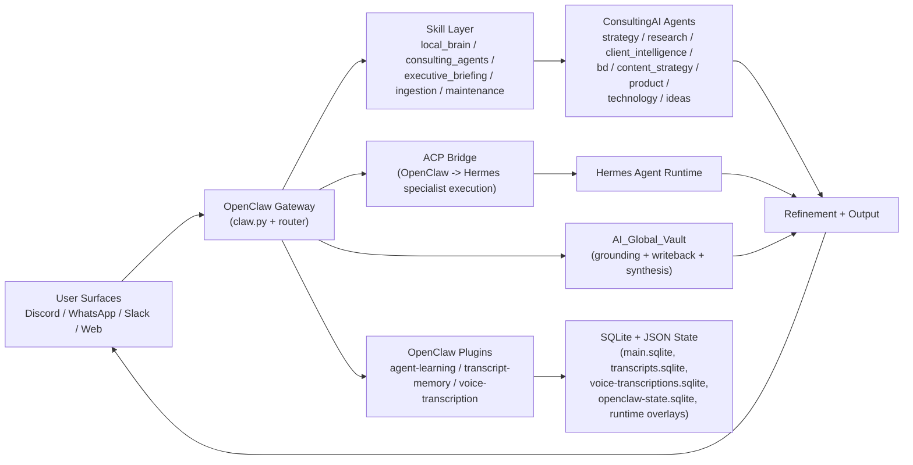

# Agent Runtime Diagram - 2026-05-01

## Current Runtime Map (OpenClaw + Hermes + ConsultingAI)

## Where ACP Exists
- ACP is the specialist execution bridge between OpenClaw and Hermes.
- Operational references are in:
  - `/Users/alijanjua/.openclaw/workspace/AGENTS.md`
  - `/Users/alijanjua/.openclaw/workspace/HANDOFF_POLICY.md`
  - `/Users/alijanjua/.openclaw/workspace/OPERATING_MODEL.md`
  - `/Users/alijanjua/.openclaw/workspace/TOOLS.md`

## Where MCP Exists
- MCP in this stack is primarily tool/plugin server infrastructure, not the core OpenClaw routing path.
- Current MCP-oriented skill assets are in:
  - `/Users/alijanjua/.openclaw/workspace/skills/mcp-server-builder/`
  - `/Users/alijanjua/.openclaw/workspace/skills/dist/mcp-server-builder.skill`
- MCP is most relevant when exposing external tools/resources to agents via server contracts.

## Practical Placement Guidance
1. Keep OpenClaw as the only public control plane.
2. Keep ACP strictly for specialist handoff into Hermes.
3. Use MCP for tool servers (integration expansion), not for replacing gateway routing.
4. Keep channel adapters (Slack/Discord/WhatsApp) at the edge and route inward through OpenClaw.

