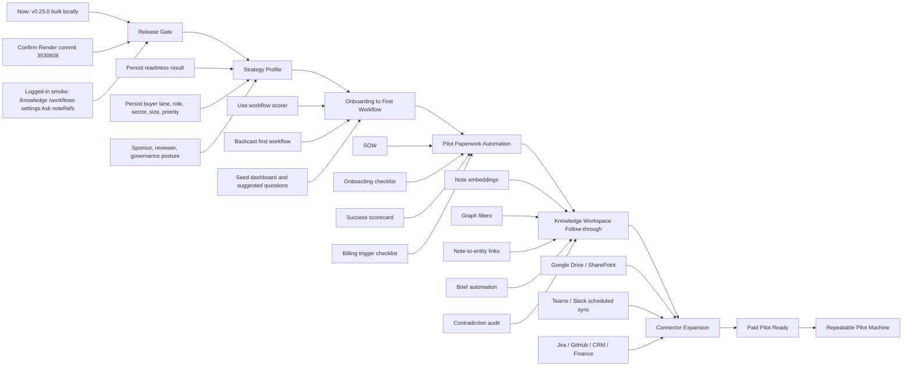
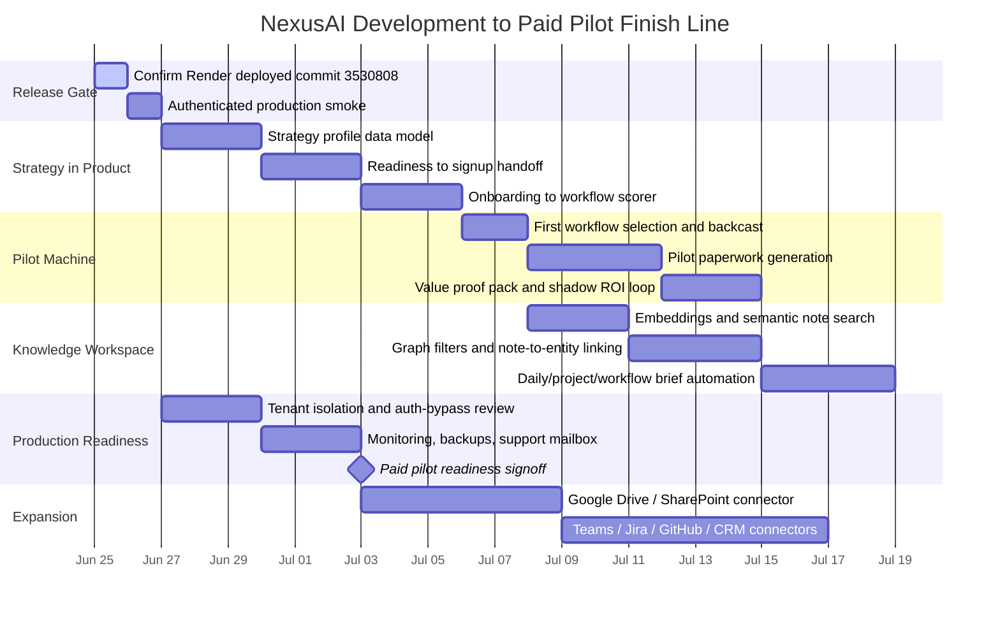

# NexusAI Development Finish Line Visual

Status: Working visualization for planning and handoff
Last updated: 2026-06-25

Use this page when you need the whole path from the current v0.25.0 state to paid-pilot readiness in one view.

## Development Map

## Finish Line Sequence

## What Done Means

```mermaid
flowchart TD
  Done["Paid Pilot Ready"] --> R["Release is live and smoked"]
  Done --> S["Strategy is persisted in product"]
  Done --> W["One workflow pilot is selected"]
  Done --> P["Paperwork is generated from that workflow"]
  Done --> K["Knowledge Workspace supports operating memory"]
  Done --> T["Trust gates are complete"]

  R --> R1["Render commit confirmed"]
  R --> R2["Logged-in smoke passed"]

  S --> S1["Buyer lane"]
  S --> S2["Readiness context"]
  S --> S3["Sponsor/reviewer"]

  W --> W1["Scored workflow"]
  W --> W2["Backcast target"]
  W --> W3["Shadow ROI metric"]

  P --> P1["SOW"]
  P --> P2["Checklist"]
  P --> P3["Scorecard"]
  P --> P4["Billing triggers"]

  K --> K1["Notes"]
  K --> K2["Entities"]
  K --> K3["Briefs"]
  K --> K4["Contradiction checks"]

  T --> T1["Tenant isolation"]
  T --> T2["Security scan"]
  T --> T3["Monitoring/backups"]
```

## Plain-English Path

First get v0.25.0 truly live, then turn the strategy from docs into product state, then make onboarding choose one valuable workflow, then generate pilot paperwork from that workflow, then let Knowledge Workspace become the operating memory around the pilot.

