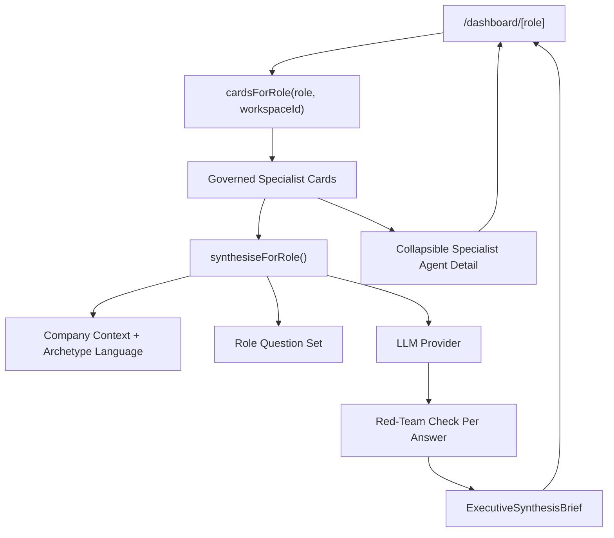

# Executive Synthesis Layer -- v0.18.2 Specification

Updated: 2026-06-10
Status: Shipped as an on-demand dashboard read layer

---

## 1. Product Principle

**Specialist agents produce signals. Leadership receives synthesis.**

The dashboard should not make a CEO, COO, CFO, CTO, or owner manually reconcile several specialist cards. NexusAI now presents one role-aware leadership brief first, then keeps the specialist agent cards underneath as the evidence trail.

This is the operating model:
- specialist agents analyse the evidence
- synthesis answers the leadership questions
- human users approve consequential action
- source evidence remains available for trust and drill-down

---

## 2. What Shipped

The v0.18.0 implementation was intentionally lightweight and safe:
- No new database migration
- No new persistent output type
- No external agent framework
- No autonomous refresh or outbound delivery
- Synthesis is computed on demand from the same governed specialist cards already used by dashboards
- Manual refresh can persist a synthesis snapshot into existing `agent_outputs`

### Shipped files

| File | Purpose |
|---|---|
| `apps/mission-control/lib/services/synthesis.ts` | Combined dispatcher and synthesis engine |
| `apps/mission-control/app/api/synthesis/[role]/route.ts` | `GET /api/synthesis/[role]` endpoint |
| `apps/mission-control/components/synthesis-brief.tsx` | Primary synthesis panel, skeleton, collapsible specialist detail |
| `apps/mission-control/components/dashboard-panel.tsx` | Dashboard reframe: synthesis first, specialist cards collapsible |
| `apps/mission-control/lib/contracts.ts` | `ExecutiveSynthesis` and `ExecutiveSynthesisQuestion` contracts |
| `apps/mission-control/lib/prompts/registry.ts` | `synthesis.executive` prompt registry entry |
| `apps/mission-control/tests/synthesis.test.ts` | Role question and contract tests |

---

## 3. Runtime Architecture



The important detail: synthesis uses the same `cardsForRole()` output as the dashboard instead of bypassing the existing generation path. On dashboards the cards are generated once and reused by synthesis; on the standalone API route synthesis can generate them directly. That preserves the current passport filtering, output gates, evidence scoping, and audit behaviour already built into specialist agent briefs.

---

## 4. API

### `GET /api/synthesis/[role]`

Example:

```http
GET /api/synthesis/ceo
Authorization: Bearer <token>
```

Optional query params:
- `department`: restrict source card generation to one department

Scope required:
- `read:dashboard`

Response shape:

```json
{
  "ok": true,
  "data": {
    "role": "ceo",
    "workspaceId": "workspace_123",
    "generatedAt": "2026-06-10T12:00:00.000Z",
    "questions": [
      {
        "question": "What is the single most important thing I need to know today?",
        "answer": "Evidence-backed answer...",
        "confidence": 0.82,
        "evidenceRefs": ["ev_1", "ev_2"],
        "sources": [
          {
            "id": "ev_1",
            "label": "board-pack.pdf",
            "sourceType": "document",
            "department": "Finance",
            "confidence": 0.91
          }
        ],
        "entities": [
          {
            "id": "ent_1",
            "type": "risk",
            "name": "Enterprise renewal delay",
            "confidence": 0.84
          }
        ]
      }
    ],
    "overallConfidence": 0.82,
    "totalEvidenceRefs": ["ev_1", "ev_2"],
    "agentCardCount": 3
  }
}
```

### `POST /api/synthesis/[role]`

Manual refresh endpoint.

```http
POST /api/synthesis/ceo
Authorization: Bearer <token>
```

Behavior:
- regenerates synthesis for the role
- persists the refreshed payload into `agent_outputs`
- uses `agent_id = synthesis_<role>`
- returns `{ ok: true, data: { synthesis, persisted: true } }`

This reuses existing U3 output versioning, audit events, active-output switching, and rollback plumbing. No new table is required.

---

## 5. Role Question Sets

### CEO / Owner / Managing Partner
1. What is the single most important thing I need to know today?
2. What is the biggest risk to our plan, and what is being done about it?
3. What decision needs my attention before the end of this week?
4. What is our execution health -- are the right things moving?
5. What does the evidence say about our commercial position?
6. Where are the people or capability gaps that could block us?
7. What should I say to the board or investors if asked today?

### COO
1. What is blocked and who owns it?
2. What process or vendor is at risk of failing us?
3. What are the top 3 execution priorities this week?
4. What does the capacity or headcount picture look like?
5. What would I escalate to the CEO today?

### CFO
1. What is the current cash and margin position?
2. Where are we tracking behind forecast, and by how much?
3. What financial risk needs immediate attention?
4. What approvals or commitments are pending?
5. What does the revenue quality look like this quarter?

### CTO / CDO
1. What is the health of our technology and data stack?
2. What security or compliance issue needs attention?
3. What architectural decision is pending?
4. Where is AI or data quality degrading our outputs?
5. What should engineering prioritise this sprint?

### CBO / CMO
1. What is the state of our commercial pipeline?
2. What market signal should we act on?
3. What is the top partnership or proposal at risk?
4. What does competitive movement look like?
5. What should I do to close or advance our biggest opportunity?

### CHRO
1. What is the hiring or attrition situation this month?
2. What culture or engagement signal needs attention?
3. Who is at risk of leaving and what is the exposure?
4. What L&D or capability gap is costing us?
5. What people issue should I escalate to the CEO?

All other roles receive a generic leadership set until a role-specific set is added.

---

## 6. Dashboard UX

### Before

```text
/dashboard/ceo
  - Strategy Agent card
  - Risk Agent card
  - Decision Agent card
```

### Now

```text
/dashboard/ceo
  - Executive Brief
      - numbered leadership questions
      - evidence-backed answers
      - confidence
      - evidence count
      - answered/total indicator
  - Specialist Agent Detail (collapsible)
      - Strategy Agent card
      - Risk Agent card
      - Decision Agent card
```

Single-agent filtered views (`?agent=...`) bypass synthesis and show specialist cards directly. This keeps power-user debugging and specialist review simple.

---

## 7. Governance

The synthesis layer inherits the existing governance path rather than duplicating it:
- `cardsForRole()` already runs specialist evidence through Agent Control Profiles.
- Specialist output gates still run in dashboard generation.
- The synthesis answer itself runs through red-team checks before display.
- The endpoint requires `read:dashboard`.
- Synthesis does not create decisions, actions, recommendations, outbound messages, or source-system writes.

If a red-team check fails, the relevant answer is replaced with a blocked-output message and an audit event is written.

---

## 8. What This Is Not Yet

The following were deliberately deferred:
- scheduled daily/weekly synthesis jobs
- learning signal buttons directly on synthesis answers
- direct decision extraction from synthesis output

Source names and entity chips were added in v0.18.1. Manual refresh/history was added in v0.18.2. The remaining items are follow-on polish, not blockers for pilot demos.

---

## 9. Verification

Local verification:
- `npm run test` passed: 21 files / 104 tests
- `npm run build` passed
- No DB migration required

Live verification target after deploy:
- `GET https://nexus-mission-control.onrender.com/api/synthesis/ceo`
- Expected unauthenticated or invalid bearer response: app-level `401`, not Render 404 or Clerk HTML rewrite

---

## 10. Sales Impact

Before:
"NexusAI gives you role dashboards with AI agent cards that analyze your documents."

After:
"NexusAI reads your company evidence, runs specialist analyses across the business, then gives leadership one evidence-backed brief on what matters, what is at risk, and what needs a decision."

The synthesis is the executive experience. The agents are the proof trail.
