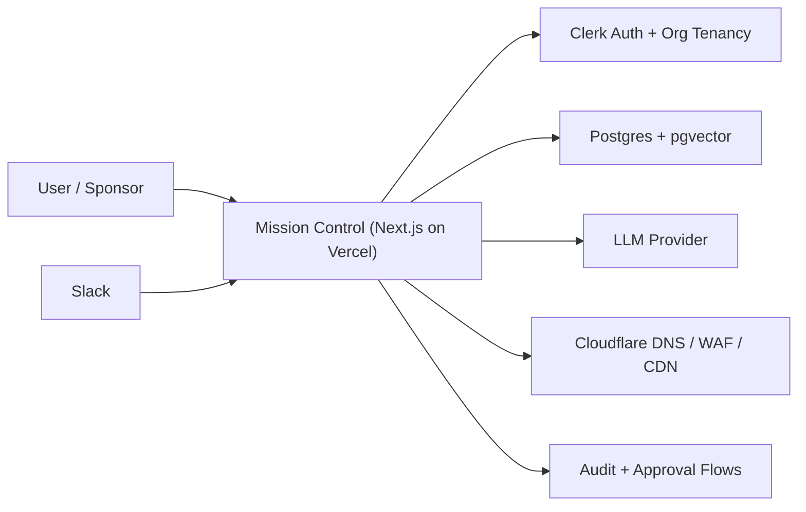

# NexusAI Infrastructure Decision Memo

Prepared: 2026-05-03
Status: Approved recommendation for V1 and pilot packaging

## Executive Summary

NexusAI should remain Vercel-first for V1 and paid pilots.

The right infrastructure decision is not "Vercel or Cloudflare." It is a staged hybrid:

1. Keep Mission Control on Vercel.
2. Keep Clerk for browser authentication and organization-scoped tenancy.
3. Keep Postgres plus `pgvector` as the evidence system of record.
4. Add Cloudflare selectively where it solves a concrete operational problem.
5. Defer any full Cloudflare runtime migration until after pilot evidence proves it is worth the rewrite.

This recommendation is driven by the current codebase, not by generic platform preference. Nexus already runs as a Next.js App Router application with Clerk middleware and a Postgres-backed evidence model. Replatforming the runtime now would introduce auth, database, and deployment risk at exactly the stage where Nexus needs trust, onboarding simplicity, and pilot velocity.

## Decision

### Final Recommendation

Adopt a hybrid infrastructure posture:

- `Mission Control runtime`: Vercel
- `Primary web framework`: Next.js App Router
- `Browser auth and org tenancy`: Clerk
- `Primary database`: Postgres
- `Vector store`: `pgvector`
- `Messaging surface`: Slack via adapter
- `DNS/CDN/WAF`: Cloudflare
- `Selective Cloudflare services`: AI Gateway first, R2 second, Queues later

### Locked Follow-Ons

These follow-ons are now the working Nexus infrastructure direction:

1. Stay on Vercel for Mission Control now.
2. Add Cloudflare AI Gateway first as the immediate low-risk enhancement.
3. Add R2 for original file retention and provenance in the next sprint.
4. Defer Queues to post-pilot hardening unless ingestion timeouts become active pain.
5. Do not move to D1 or Vectorize in V1.

### What We Are Not Doing Now

- No full migration of Mission Control to Cloudflare Workers or Pages
- No migration from Postgres to D1
- No migration from `pgvector` to Vectorize in V1
- No auth-system rewrite away from Clerk for pilot packaging

## Current State Baseline

The current Nexus implementation already establishes a strong infrastructure baseline:

- `apps/mission-control` is a Next.js Mission Control application
- middleware is built around Clerk session auth plus Bearer-token agent routes
- pilot deployment documentation is already Vercel-oriented
- evidence, approvals, recommendations, entities, audit events, connectors, and workspaces are modeled in Postgres
- Slack is implemented as a governed secondary surface, not as the source of truth

This matters because infrastructure decisions should preserve the real operating system that exists today, not reset it in pursuit of theoretical savings.

## Decision Drivers

The infrastructure choice for Nexus should optimize for the following, in this order:

1. Pilot reliability
2. Fast customer onboarding
3. Trusted evidence and approval workflows
4. Tenant and workspace isolation
5. Operator visibility and cost control
6. Long-term extensibility without premature rewrites

The V1 product is not primarily a chatbot or a generic serverless demo. It is an executive evidence and governance system. That means data trust, auth, approval flows, and source provenance matter more than shaving a few hundred milliseconds off cold starts.

## Option Analysis

### Option A: Stay Vercel-First

This means:

- Next.js app remains on Vercel
- Clerk remains the auth layer
- Postgres remains the system of record
- Cloudflare is used for DNS, CDN, WAF, and optionally selected services

Benefits:

- Matches the current codebase and deployment runbook
- Lowest migration risk
- Strong Next.js App Router support
- Strong Clerk compatibility
- Minimal time-to-pilot
- Easier self-serve signup and browser auth path

Costs and limitations:

- Cold starts remain possible on some serverless paths
- Long-running ingestion and processing routes will need hardening
- Usage costs can rise if ingestion and synthesis become heavy

Verdict:

Best choice for V1 and the first paid pilots.

### Option B: Full Cloudflare Runtime Migration

This means:

- Move the web runtime toward Cloudflare Workers or Pages
- Rework data access around Cloudflare-compatible patterns
- Rework auth patterns around edge-compatible alternatives

Benefits:

- Excellent edge distribution
- Low-latency serverless runtime
- Strong integrated ecosystem for storage, cache, queues, and gateway services
- Attractive free and low-cost tiers

Costs and blockers:

- Requires runtime refactor, not a lift-and-shift
- Creates real compatibility risk for current auth and DB layers
- Introduces platform migration work during pilot packaging
- Increases lock-in around Cloudflare bindings if adopted aggressively

Verdict:

Wrong move for Nexus right now. Revisit after pilots only if data proves a material need.

### Option C: Hybrid Vercel Plus Cloudflare

This means:

- Keep Mission Control on Vercel
- Use Cloudflare for DNS, CDN, WAF, AI Gateway, and selected storage or async services

Benefits:

- Preserves the current application
- Captures high-value Cloudflare capabilities without runtime rewrite
- Gives a clean path to introduce cost controls and async processing incrementally

Costs:

- Some operational complexity across vendors
- Requires disciplined documentation of which layer owns what

Verdict:

Best overall architecture posture for Nexus over the next 2 to 4 quarters.

## Hard Technical Constraints

The strongest reason not to migrate now is technical, not emotional.

### 1. Clerk-Centric Auth Is Already Load-Bearing

Mission Control middleware is built around Clerk session auth for browsers and scoped Bearer-token bypass for agent-compatible API routes. That gives Nexus:

- browser login and signup
- organization-aware workspace isolation
- protected server components
- protected API routes
- clean user-to-workspace mapping

Changing the runtime while this auth layer is still stabilizing would create unnecessary risk in signup, onboarding, and tenancy flows.

### 2. Postgres Plus `pgvector` Is Already the Right V1 Evidence Store

Nexus needs:

- relational joins across workspaces, evidence, approvals, decisions, and recommendations
- append-only audit behavior
- hybrid retrieval patterns
- future room for structured filtering alongside embeddings

That is a better fit for Postgres plus `pgvector` than for a V1 move to D1 or a narrower vector-only path.

### 3. The Current Product Needs Governance More Than Edge Runtime Purity

Nexus is judged by:

- whether evidence is trustworthy
- whether recommendations have provenance
- whether approvals are visible
- whether sensitive data is withheld from Slack

Those are workflow and policy problems first. They do not get solved by changing compute runtimes.

## Recommended Infrastructure Shape

### V1 and Pilot Architecture

### Recommended Ownership by Layer

| Layer | Recommended Owner | Why |
|---|---|---|
| Web runtime | Vercel | Native fit for Next.js App Router and current app |
| Auth and org tenancy | Clerk | Already integrated and suitable for self-serve signup |
| Evidence DB | Postgres | Best fit for structured evidence, approvals, and audit trails |
| Vector retrieval | `pgvector` | Keeps retrieval close to evidence model |
| DNS and edge security | Cloudflare | Strong DNS, CDN, WAF, and email-routing posture |
| Messaging surface | Slack adapter | Secondary surface with safety boundaries |
| Async heavy processing | Deferred hybrid service | Add only when ingestion volume proves the need |

## Cloudflare Build vs Buy Decision

Cloudflare is still valuable for Nexus, but selectively.

### Adopt Now: AI Gateway

This is the best immediate Cloudflare addition.

Why it maps well to Nexus:

- centralizes LLM usage visibility
- helps control spend during pilot experimentation
- provides request logging and routing visibility
- can support rate limiting and safer failover posture
- does not require a runtime migration

Implementation shape:

- make `ANTHROPIC_BASE_URL` configurable
- route Anthropic traffic through Cloudflare AI Gateway when configured
- keep provider keys and model config otherwise unchanged

Priority:

Immediate

### Adopt Next: R2 for Original File Retention

This is the second-best Cloudflare addition.

Why it matters:

- the original uploaded file should remain available for auditability
- quarantined items should still be reviewable against the source
- re-extraction should be possible when parsing improves
- provenance becomes stronger when `sourceUri` points to a retained original

Implementation shape:

- upload original files to R2 before extraction
- persist the object key in `sourceUri`
- expose a controlled "view original" or "download original" path inside Mission Control

Priority:

Next sprint

### Adopt Later: Queues

This is valuable, but not the next move.

Why it matters:

- large document ingestion and heavy synthesis will eventually outgrow synchronous request patterns
- queue-backed extraction and synthesis will improve reliability and reduce timeout risk

Why to defer:

- adds cross-platform operational complexity
- not required before pilot onboarding and dashboard trust are solid

Priority:

Post-pilot hardening or first scale milestone

### Skip for V1: D1, Vectorize, KV as Core Dependencies

Why:

- D1 is not a better fit than the existing Postgres model for Nexus V1
- Vectorize is not necessary while `pgvector` already fits the retrieval design
- KV may be useful later for narrow caching problems, but it is not a current infrastructure blocker

## Self-Serve Signup and Client Onboarding Implications

The current Vercel plus Clerk direction is also the best path for the onboarding motion you want:

- browser-first signup
- organization creation
- workspace provisioning
- connector authorization
- document upload and first dashboard generation

For that motion, the simplest near-term stack is:

1. Clerk handles signup, login, organizations, and session lifecycle.
2. Mission Control provisions a workspace on first org creation.
3. The onboarding wizard handles source connection and first ingestion.
4. Slack and other connectors remain opt-in during onboarding.

This is cleaner and faster than pausing to redesign auth around an edge-runtime-first architecture.

## Cost and Operational Posture

For Nexus at pilot stage, the right question is not "what is the cheapest compute platform?" It is "what stack gives the lowest risk per trusted executive output?"

Vercel is likely the better answer for:

- product speed
- deployment simplicity
- signup flow stability
- dashboard-first UI iteration

Cloudflare is likely the better answer for:

- DNS and edge protection
- AI request observability
- lower-cost object storage
- future async infrastructure pieces

That makes hybrid the sensible economic posture too.

## Phased Recommendation

### Phase 1: Lock the V1 Baseline

- keep Vercel as the Mission Control runtime
- keep Clerk as the auth layer
- keep Postgres plus `pgvector`
- keep Slack as a secondary governed surface

### Phase 2: Add Cloudflare AI Gateway

- make LLM base URL configurable
- route supported models through the gateway
- capture usage, latency, and spend data

### Phase 3: Add R2

- persist original documents
- strengthen provenance and audit review
- support reprocessing without asking the client to re-upload

### Phase 4: Add Async Processing

- only when evidence ingestion volume, timeout rate, or synthesis latency justify it
- choose Cloudflare Queues or another queue worker path based on actual telemetry

### Phase 5: Reevaluate Full Runtime Strategy

Only revisit a broader Cloudflare runtime move if all of the following become true:

- pilot customers complain about latency or reliability tied to the current runtime
- LLM and ingestion workloads materially outgrow the current request model
- the auth and tenant model are stable enough that a runtime migration does not jeopardize onboarding
- projected savings or capability gains clearly outweigh rewrite cost

## Go / No-Go Checklist

Stay Vercel-first if:

- Next.js App Router remains the core Mission Control surface
- Clerk signup and organizations are central to onboarding
- Postgres remains the evidence system of record
- pilot velocity is more important than infrastructure experimentation

Consider deeper Cloudflare runtime adoption only if:

- async workloads become the main bottleneck
- object storage and queue volume become significant cost centers
- auth and DB runtime compatibility are explicitly solved
- there is a measured business case, not just platform enthusiasm

## Final Position

Nexus should not migrate off Vercel during V1 and pilot packaging.

The correct move is to preserve the current application architecture, add Cloudflare where it meaningfully improves cost control or operational resilience, and revisit any larger runtime migration only after pilot telemetry and customer usage patterns justify the change.
