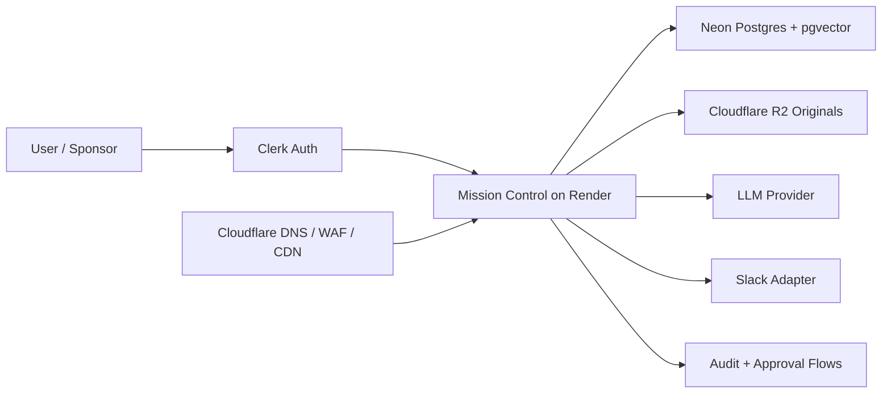

# NexusAI Infrastructure Decision Memo

Prepared: 2026-06-01
Status: Approved operating direction for V1 pilot hosting

## Executive Summary

NexusAI should run on a pragmatic managed-cloud stack for V1 pilots:

- Render for the Mission Control web service
- Neon Postgres with `pgvector` as the system of record
- Clerk for browser authentication and organization tenancy
- Cloudflare R2 for original document retention
- Cloudflare selective services for DNS, WAF, CDN, and optional AI Gateway

The goal is not infrastructure purity. The goal is a reliable, understandable pilot stack that supports self-signup, governed evidence ingestion, agent output history, and human approval workflows without introducing avoidable platform rewrites.

## Decision

### Locked Direction

| Layer | Choice | Reason |
|---|---|---|
| Web runtime | Render Web Service | Simple managed Node runtime for the current Next.js app |
| Database | Neon Postgres | Managed Postgres, direct migration URL, good pilot fit |
| Vector search | `pgvector` | Keeps semantic search close to evidence and governance joins |
| Auth | Clerk | Already integrated for signup, login, and organizations |
| File storage | Cloudflare R2 | Low-cost original-file retention with S3-compatible APIs |
| Edge/security | Cloudflare selective services | DNS, CDN, WAF, AI Gateway where useful |
| Messaging | Slack adapter first | Governed secondary interface, not source of truth |

### What We Are Not Doing in V1

- No full runtime migration to edge workers
- No migration from Postgres to SQLite-style serverless databases
- No split vector database unless retrieval load proves it is necessary
- No autonomous writeback to enterprise systems
- No replacement of Clerk during pilot packaging

## Why This Fits NexusAI

NexusAI is a governed intelligence operating layer for high-stakes professional workflows. It is judged by:

- evidence provenance
- tenant isolation
- human approval
- output rollback
- auditability
- controlled data exposure

Those are data-governance problems before they are raw compute problems. A relational-first system with Postgres and `pgvector` is the right foundation for the pilot.

## Current Architecture

## Decision Drivers

Infrastructure decisions should optimize for:

1. Pilot reliability
2. Fast customer onboarding
3. Trusted evidence and approval workflows
4. Tenant and workspace isolation
5. Operator visibility and cost control
6. Extensibility without premature rewrites

## Cloudflare Role

Cloudflare remains valuable, but selectively:

- R2 stores original uploaded files for provenance and re-review.
- DNS/CDN/WAF protect the public surface.
- AI Gateway can add LLM observability, rate limiting, and provider controls.
- Queue-style async processing is a later hardening option if ingestion timeouts become a real bottleneck.

Cloudflare data products that would replace Postgres are intentionally deferred for V1 because Nexus needs joins, audit trails, approvals, and filtered retrieval in one system of record.

## Database Strategy

Postgres is the primary system of record for:

- workspaces
- users and roles
- evidence records
- recommendations
- decisions
- approvals
- audit events
- agent control profiles
- agent outputs
- learning signals
- workflow twin primitives

`pgvector` is used for semantic retrieval when enabled. Keyword retrieval remains a fallback.

## Deployment Strategy

Primary deployment path:

1. Push to GitHub.
2. Render blueprint reads `render.yaml`.
3. Render builds and starts the Next.js app.
4. Neon direct URL is used for migrations.
5. Neon pooled URL is used by the app at runtime.
6. Clerk and Slack callback URLs point to the deployed Render domain.

## Cost and Scale Notes

Render free services may sleep when idle. That is acceptable for demos and early pilots. Paid Render instances should be used when:

- a customer expects instant first-load response
- onboarding calls depend on live demos
- scheduled jobs or webhook reliability become business-critical

Neon remains the database path unless storage, connection count, or region requirements force a direct upgrade.

## Future Revisit Triggers

Revisit infrastructure only if one of these becomes true:

- ingestion jobs time out under real customer load
- cold starts materially hurt paid pilot usage
- a regulated client requires a specific region or dedicated deployment
- retrieval volume requires a separate vector/search layer
- customer security requirements require private networking or on-prem processing

Until then, keep the stack boring, auditable, and easy to operate.
